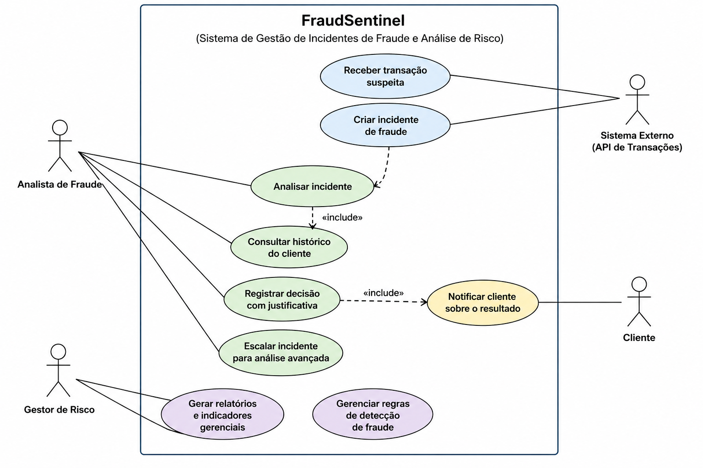
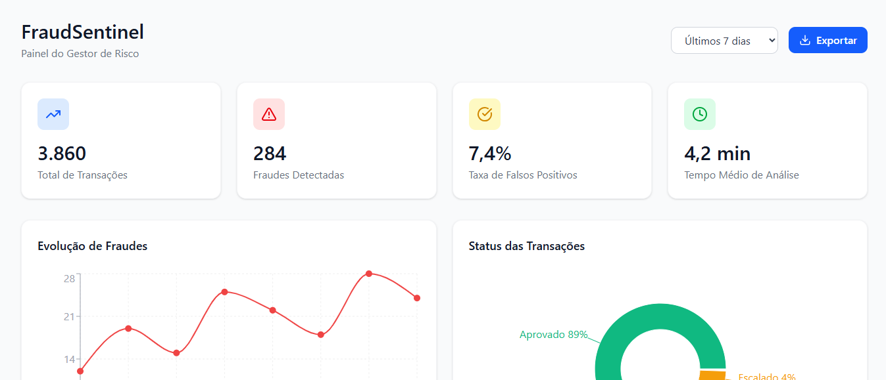
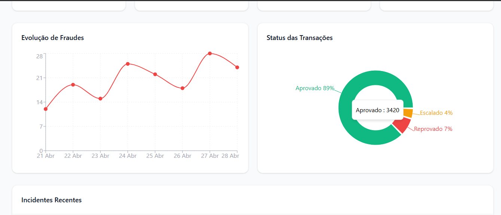
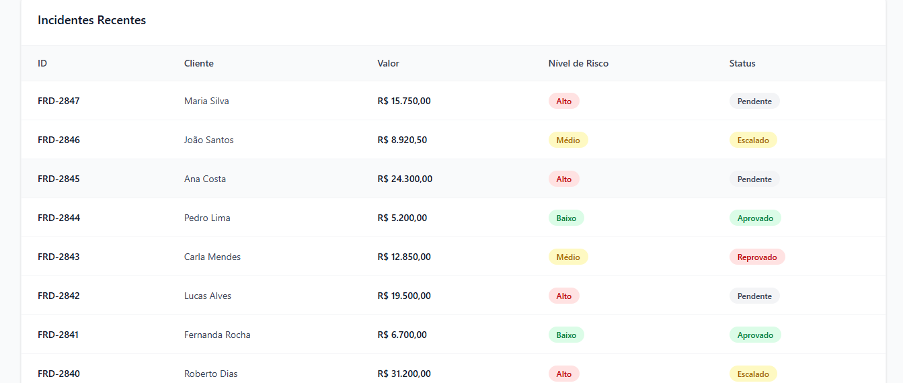
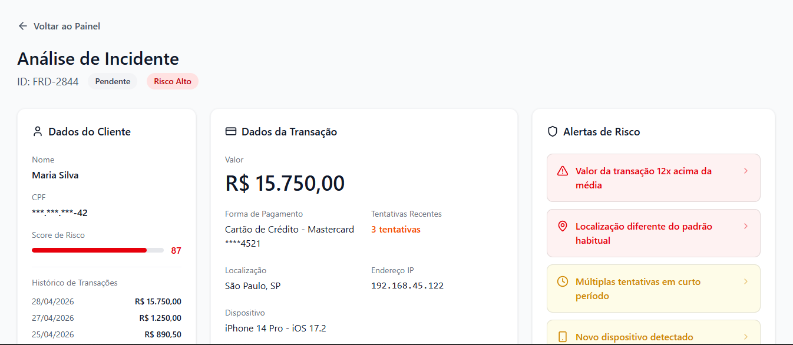
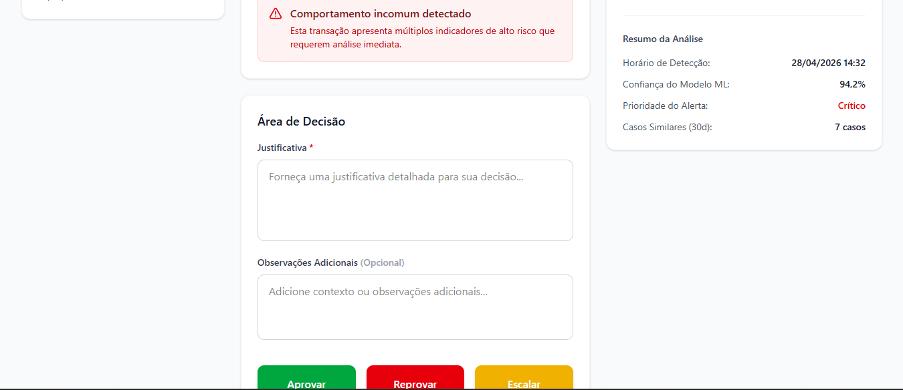
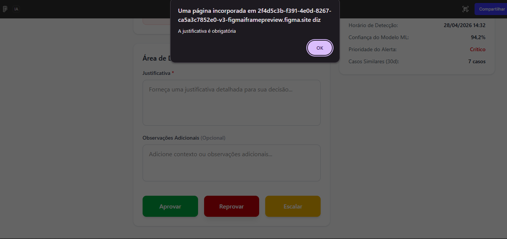

# 🔍 FraudSentinel — Sistema de Gestão de Incidentes de Fraude

Projeto de análise de requisitos, modelagem UML e prototipação de um sistema antifraude voltado para análise de transações suspeitas e tomada de decisão.

---

## 🎯 Objetivo

Desenvolver uma solução capaz de apoiar analistas na identificação de fraudes, reduzindo falsos positivos e aumentando a eficiência operacional na tomada de decisão.

---

## 🧠 Problema de Negócio

Sistemas antifraude tradicionais enfrentam desafios como:

* Alto volume de falsos positivos
* Lentidão na análise de transações
* Falta de centralização de informações
* Dificuldade na rastreabilidade das decisões

---

## 💡 Solução Proposta

O **FraudSentinel** foi projetado para:

* Centralizar dados críticos de análise em uma única interface
* Destacar alertas de risco de forma visual e intuitiva
* Permitir decisões rápidas (Aprovar, Reprovar, Escalar)
* Garantir registro auditável de todas as decisões
* Apoiar gestores com indicadores estratégicos

---

## 👥 Atores do Sistema

* **Analista de Fraude** → Analisa transações e toma decisões
* **Gestor de Risco** → Monitora indicadores e ajusta regras
* **Sistema Externo (API)** → Envia transações suspeitas
* **Cliente** → Recebe notificações

---

## 🔄 Principais Funcionalidades

* Recebimento de transações suspeitas
* Criação e gestão de incidentes
* Análise de perfil e histórico do cliente
* Registro de decisão com justificativa obrigatória
* Notificação automática ao cliente
* Geração de relatórios e indicadores
* Gestão de regras antifraude

---

## 📊 Diagrama de Casos de Uso (UML)

---

## 🖥️ Protótipos de Interface (Figma)

### 📊 Dashboard do Gestor

---

### 📈 Métricas e Indicadores

---

### 📋 Lista de Incidentes

---

### 🔍 Análise de Incidente

---

### 🧾 Área de Decisão

---

### ⚠️ Validação de Erro

---

## ⚙️ Tecnologias e Conceitos Aplicados

* Engenharia de Requisitos
* UML (Casos de Uso)
* UX/UI Design (Figma)
* Modelagem de Fluxos (principal, alternativo e exceção)

---

## 🧠 Principais Decisões de Design

* Uso de cores para indicar níveis de risco
* Centralização de informações críticas para reduzir tempo de análise
* Destaque visual para alertas de fraude
* Ações de decisão com alta visibilidade
* Validação obrigatória de justificativa para auditoria

---

## 📈 Aprendizados

* Tradução de requisitos em soluções estruturadas
* Modelagem de sistemas com foco em negócio
* Integração entre lógica de sistema e experiência do usuário
* Importância da rastreabilidade e consistência

---

## 🚀 Sobre o Projeto

Projeto desenvolvido com foco na prática de engenharia de requisitos e análise de sistemas, simulando um cenário real de prevenção à fraude.

---

## 🔗 Próximos Passos

* Evolução para protótipo interativo
* Integração com API simulada
* Implementação de regras dinâmicas de risco

---

